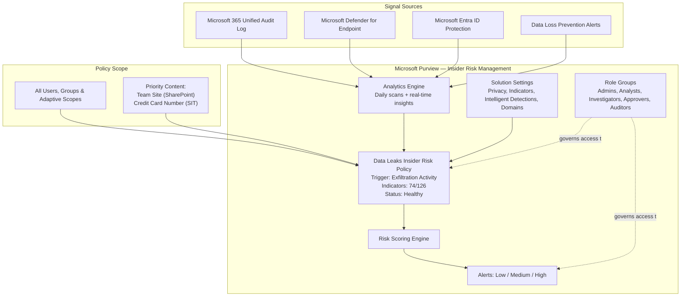

# Microsoft Purview Insider Risk Management — Data Leaks Policy Deployment


> Enterprise implementation of **Microsoft Purview Insider Risk Management (IRM)** — from solution-wide analytics, privacy, and indicator configuration through a fully scoped, tenant-wide **Data Leaks** policy, validated by initiating activity scoring for a test user. Built entirely from 30 sequential screenshots with no invented configuration.

---

## Table of Contents

- [Project Overview](#project-overview)
- [Architecture Diagram](#architecture-diagram)
- [Prerequisites](#prerequisites)
- [Licensing Requirements](#licensing-requirements)
- [Microsoft 365 Components Used](#microsoft-365-components-used)
- [Implementation Flow](#implementation-flow)
- [PowerShell Verification](#powershell-verification)
- [Validation Summary](#validation-summary)
- [Case Study](#case-study)
- [Troubleshooting](#troubleshooting)
- [Known Limitations](#known-limitations)
- [Best Practices](#best-practices)
- [Lessons Learned](#lessons-learned)
- [Security Benefits](#security-benefits)
- [Business Benefits](#business-benefits)
- [Skills Demonstrated](#skills-demonstrated)
- [Certification Mapping](#certification-mapping)
- [Microsoft Learn References](#microsoft-learn-references)
- [Repository Structure](#repository-structure)
- [GitHub Topics](#github-topics)

---

## Project Overview

### Purpose

Configure and validate **Microsoft Purview Insider Risk Management** to detect potential data leaks — from accidental oversharing to intentional data theft — across an entire Microsoft 365 tenant, using Microsoft's Quick Policy framework, tenant-specific analytics-derived thresholds, and multi-step sequence detection.

### Business Scenario

Regulated and data-sensitive organizations need visibility into risk posed by authorized insiders — employees who already have legitimate access to sensitive data but who may exfiltrate it accidentally or intentionally (for example, before resignation). Perimeter controls such as firewalls and Conditional Access do not address this risk, because the actor is an authenticated, authorized user operating within their normal access boundaries.

### Problem Statement

Without a dedicated insider risk solution, low-signal individual activities — a SharePoint download here, a sensitivity label removed there, a file archived and copied to USB — go undetected in isolation, even though the same activities performed in sequence are a strong indicator of intentional data exfiltration.

### Solution Overview

Microsoft Purview Insider Risk Management was configured to:

1. Enable **analytics** at both tenant and user aggregation levels to build a behavioral baseline.
2. Configure solution-wide settings: **privacy/pseudonymization**, **policy indicators** (Office, Device, Defender for Endpoint, Risky browsing), **intelligent detections**, and **domain lists**.
3. Review the seven built-in **Insider Risk Management role groups** for least-privilege administration.
4. Build a tenant-wide **Data Leaks** policy from a Microsoft Quick Policy template, with content prioritization, tenant-specific thresholds, and full sequence detection.
5. Submit the policy, confirm **Healthy** status, and **start activity scoring** for a named test user to validate the deployment end-to-end.

---

## Architecture Diagram



See [`diagrams/Architecture.mmd`](diagrams/Architecture.mmd) for the standalone diagram source.

---

## Prerequisites

| # | Prerequisite | Status in This Lab |
|---|---|---|
| 1 | Microsoft Purview compliance portal access | Confirmed |
| 2 | Insider Risk Management analytics turned on | Confirmed — Completed |
| 3 | Insider Risk Management settings configured | Confirmed |
| 4 | Admin/analyst assigned to a role group with alert-view permission | **Not fully configured** — only the broad base group has an assigned user |
| 5 | DLP policy configured (optional prerequisite for Data leaks template) | Satisfied (green check in wizard) |
| 6 | Devices onboarded to Microsoft Defender for Endpoint | Satisfied (green check in wizard) |
| 7 | Physical badging connector (optional) | Not configured in this lab |
| 8 | Cloud app connectors (optional) | Not configured in this lab |
| 9 | At least one Sensitive Information Type defined | Confirmed — Credit Card Number |
| 10 | At least one SharePoint site identified for prioritization | Confirmed — Team Site |

## Licensing Requirements

> Licensing tiers were not visible in the screenshots. The table reflects Microsoft's published guidance and should be verified independently before production planning.

| License | Capability |
|---|---|
| Microsoft 365 E5 / A5 / G5 | Full Insider Risk Management, all policy templates |
| Microsoft 365 E5 / A5 / G5 Compliance add-on | Full Insider Risk Management as an E3 add-on |
| Microsoft 365 E5 / A5 / G5 Insider Risk Management add-on | Dedicated add-on on top of E3 |
| Microsoft Defender for Endpoint P2 | Required for Defender-sourced indicators |
| Microsoft Defender for Cloud Apps | Required for cloud app/cloud storage indicators |
| Microsoft Entra ID P2 | Required for Entra ID Protection indicators |

## Microsoft 365 Components Used

- Microsoft Purview compliance portal — Insider Risk Management solution
- Microsoft 365 Unified Audit Log (Office and Device indicators)
- Microsoft Defender for Endpoint (defense evasion, unwanted software indicators)
- Microsoft Purview Data Loss Prevention (optional trigger/prerequisite)
- Microsoft Entra ID Protection (identity-risk indicators)
- Microsoft Purview Roles and Scopes (role group RBAC)

---

## Implementation Flow

Every step below is backed by a screenshot in [`images/`](images/). No configuration is described that is not visible in the referenced image. Full step-by-step detail, including every option's purpose, security rationale, and "what if selected differently" analysis, is in [`docs/Implementation-Guide.md`](docs/Implementation-Guide.md).

| Step | Title | Image |
|---|---|---|
| 1 | Navigate to Insider Risk Management from the Purview Solutions menu | `01-Microsoft-Purview-Solutions-Overview.png` |
| 2 | Review the Overview page and recommended actions (analytics Completed) | `02-Insider-Risk-Management-Overview.png` |
| 3 | Review full Recommendations: Setup and Fine-tuned detection | `03-Insider-Risk-Recommendations-Setup.png` |
| 4 | Review Comprehensive protection and Extended integration recommendations | `04-Insider-Risk-Recommendations-Protection.png` |
| 5 | Configure Analytics settings (tenant + user level insights: On) | `05-Analytics-Settings.png` |
| 6 | Configure Privacy settings (pseudonymized usernames selected) | `06-Privacy-Settings.png` |
| 7 | Enable Policy indicators — Office activities (Select all) | `07-Policy-Indicators-Office-Activities.png` |
| 8 | Enable Policy indicators — Device activities (Select all) | `08-Policy-Indicators-Device-Activities.png` |
| 9 | Enable Defender for Endpoint and Risky browsing indicators (preview) | `09-Policy-Indicators-Defender-Risky-Browsing.png` |
| 10 | Configure Intelligent detections — file activity threshold (50 events), Default alert volume | `10-Intelligent-Detections-Configuration.png` |
| 11 | Configure Defender alert statuses (all 4) and Unallowed domains (empty) | `11-Defender-Alert-Status-Domain-Configuration.png` |
| 12 | Configure Third-party domains (empty) | `12-Third-Party-Domain-Configuration.png` |
| 13 | Review Insider Risk Management role groups (7 groups; only base group has 1 user) | `13-Insider-Risk-Role-Groups.png` |
| 14 | Open Policies page; role-group warning banner; Create policy menu | `14-Create-Insider-Risk-Policy.png` |
| 15 | Review Quick Policy templates; select Data leaks | `15-Quick-Policy-Templates.png` |
| 16 | Review Data leaks template prerequisites and triggering events | `16-Select-Policy-Template-Data-Leaks.png` |
| 17 | Name the policy: "Data Leaks Insider Risk Policy" | `17-Policy-Name-and-Description.png` |
| 18 | Scope: All users, groups, and adaptive scopes | `18-Users-Groups-and-Adaptive-Scopes.png` |
| 19 | Enable content prioritization (SharePoint, labels, SITs, extensions, classifiers) | `19-Content-Prioritization-Options.png` |
| 20 | Prioritize SharePoint site: Team Site | `20-SharePoint-Sites-Prioritization.png` |
| 21 | Prioritize sensitive info type: Credit Card Number | `21-Sensitive-Information-Types-Configuration.png` |
| 22 | Scoring scope: Get alerts for all activity | `22-Configure-Activity-Scoring-for-Priority-Content.png` |
| 23 | Triggering event: User performs an exfiltration activity (8/24 activities) | `23-Select-Triggering-Events-for-Insider-Risk-Policy.png` |
| 24 | Trigger thresholds: Apply built-in thresholds (Recommended) | `24-Configure-Trigger-Thresholds-for-Exfiltration-Activities.png` |
| 25 | Indicators selected: 51/103 at this wizard step | `25-Configure-Insider Risk-Indicators.png` |
| 26 | Detection options: full sequence detection enabled (download/archive/label-downgrade chains) | `26-Configure-Detection-Options-for-Activity-Sequences.png` |
| 27 | Indicator thresholds: Apply thresholds specific to your users' activity (Recommended) | `27-Configure-Indicator-Threshold-Settings.png` |
| 28 | Final review: 74/126 indicators; Submit | `28-Review-Insider-Risk-Policy-Configuration.png` |
| 29 | Policy created — Status: Healthy | `29-Data-Leaks-nsider-Risk-Policy-Successfully-Created.png` |
| 30 | Start activity scoring for Test User 1 (5-day scope) | `30-Start-Activity-Scoring-for-Selected-Users.png` |

> **Not configured in this lab / explicitly flagged gaps:** the current session lacks a role group with alert-viewing permission (Step 14 banner); Microsoft Defender for Cloud Apps, Microsoft Fabric, physical badging, and network signal connectors were not connected, leaving their indicator categories at 0 selected (Step 25); the Unallowed and Third-party domains lists were left empty (Steps 11–12). The indicator count changes from 51/103 mid-wizard (Step 25) to 74/126 at final review (Step 28) — both figures are reported exactly as captured rather than reconciled.

---

## PowerShell Verification

Insider Risk Management does not expose the same breadth of PowerShell cmdlets as Exchange Online, but Security & Compliance PowerShell can be used to connect to the tenant and support role group and case-related verification. See [`scripts/`](scripts/) for reusable versions.

```powershell
# Connect to Security & Compliance PowerShell (required for Purview role and policy verification)
Connect-IPPSSession -UserPrincipalName admin@securem365lsb.onmicrosoft.com

# Review Insider Risk Management role group membership
Get-RoleGroupMember -Identity "Insider Risk Management"
Get-RoleGroupMember -Identity "Insider Risk Management Analysts"
Get-RoleGroupMember -Identity "Insider Risk Management Investigators"
```

> Insider Risk Management policy and alert data is primarily managed through the Microsoft Purview portal UI and Microsoft Graph security API rather than a dedicated PowerShell module; the scripts in this repository focus on the role-group and connectivity verification that PowerShell does support.

---

## Validation Summary

| Validation Point | Method | Evidence | Result |
|---|---|---|---|
| Analytics enabled (tenant + user level) | Purview portal settings | Image 05 | Pass |
| Privacy/pseudonymization configured | Purview portal settings | Image 06 | Pass |
| Office, Device, Defender, Risky Browsing indicators enabled | Purview portal settings | Images 07–09 | Pass |
| Role groups reviewed | Roles and scopes | Image 13 | Partial — specialized groups have 0 assigned users |
| Policy created from Data Leaks template | Policy wizard | Images 15–16 | Pass |
| Content prioritization configured | Policy wizard | Images 19–21 | Pass |
| Triggering event and thresholds configured | Policy wizard | Images 23–24, 27 | Pass |
| Sequence detection configured | Policy wizard | Image 26 | Pass |
| Policy submitted and reaches Healthy status | Policies list | Images 28–29 | Pass |
| Activity scoring started for test user | Policies action | Image 30 | Pass |
| Alert generation confirmed | — | Not captured | **Not validated in this lab** |

---

## Case Study

### Executive Summary

This project configures and validates Microsoft Purview Insider Risk Management with a tenant-wide Data Leaks policy, moving from an empty solution instance through analytics enablement, indicator and privacy configuration, and a fully scoped policy that reaches Healthy status with activity scoring actively initiated for a test user.

### Business Requirement

Organizations need to detect data exfiltration by authorized insiders — activity that perimeter and identity controls do not address, since the actor already has legitimate access. A general-purpose, organization-wide Data Leaks policy provides baseline coverage before narrower, asset-specific policies (Critical asset protection, Risky AI Usage) are layered in.

### Implementation

Analytics was enabled at tenant and user level to establish a behavioral baseline. Office, Device, Defender for Endpoint, and Risky browsing indicators were enabled tenant-wide. A Data Leaks policy was built from Microsoft's Quick Policy template, scoped to all users, with SharePoint and Credit Card Number content prioritization, exfiltration-activity triggering, tenant-specific thresholds, and full multi-step sequence detection.

### Validation

The policy reached **Healthy** status immediately after submission. Activity scoring was explicitly started for a named test user (Test User 1, 5-day scope) to validate the deployment functions end-to-end, rather than waiting passively for organic activity.

### Challenges

Two gaps were identified during configuration rather than after the fact: the signed-in session lacked a role group with alert-viewing permission (a banner surfaced this directly in the Policies page), and several indicator categories (Cloud Apps, Cloud Storage, Microsoft Fabric, Network) remained at 0 selected because their underlying connectors were not configured.

### Resolution

Both gaps are documented as explicit, unresolved items in this repository (see Known Limitations and Troubleshooting) rather than glossed over, consistent with an evidence-only documentation standard. They represent the next logical phase of this deployment's maturity, not defects in the steps performed.

### Outcome

A tenant-wide Data Leaks Insider Risk Management policy was successfully built, submitted, and confirmed Healthy, with activity scoring functionally validated against a real test user.

### Key Takeaways

- Enabling an indicator at the solution-settings level does not guarantee it is available at the policy level — indicator availability can still be individually gated during policy creation.
- A "Healthy" policy status is a structural validation, not proof of active alerting; explicit test-user scoring is a necessary additional step.
- Several of the richest indicator categories depend entirely on optional connector prerequisites (Defender for Cloud Apps, Microsoft Fabric, physical badging) that are easy to overlook when following the Quick Policy path.

---

## Troubleshooting

See [`docs/Troubleshooting.md`](docs/Troubleshooting.md) for the full guide.

| Symptom | Likely Cause | Resolution |
|---|---|---|
| "You currently aren't assigned to a role group that allows you to view alerts" | No user assigned to a role group with alert-view permission | Assign the appropriate user(s) to Analysts/Investigators role group |
| Indicators greyed out during triggering-event selection | Indicator turned off at tenant/solution-settings level | Use "Turn on indicators" or enable in Policy indicators settings |
| Zero indicators selected in Cloud Apps/Storage/Fabric/Network categories | Underlying connector not configured | Connect the relevant data source |
| Policy Healthy but zero alerts | Alert generation can take up to 24 hours; scoring must be started explicitly | Wait for the processing window; confirm scoring was started |

## Known Limitations

- The signed-in administrator's session was not assigned to a role group with alert-viewing permission at the time of capture.
- Cloud app, cloud storage, cloud service, Microsoft Fabric, physical badging, and network signal connectors were not configured, leaving those indicator categories unpopulated.
- Unallowed domains and Third-party domains lists were left empty.
- Alert generation itself (post-scoring) was not captured in available evidence.

---

## Best Practices

See [`docs/Best-Practices.md`](docs/Best-Practices.md) for the full guide. Highlights:

- Assign named users to the specific functional role groups (Analysts, Investigators, Approvers, Auditors) rather than relying on the broad base group.
- Pilot a new policy against a scoped user population before expanding to "All users."
- Prefer tenant-specific, analytics-derived thresholds over generic Microsoft defaults once baseline data exists.
- Track unmet optional connector prerequisites as a prioritized backlog rather than leaving them permanently unconfigured.

## Lessons Learned

See [`docs/Lessons-Learned.md`](docs/Lessons-Learned.md) for the full write-up.

## Security Benefits

- Correlates low-signal individual activities into higher-confidence, multi-step sequence alerts (download → obfuscate → exfiltrate → delete).
- Defaults to pseudonymized identities, supporting privacy-by-design during initial alert triage.
- Provides a purpose-built RBAC model (Admins, Analysts, Investigators, Approvers, Auditors, Session Approvers) to enforce separation of duties across the investigation lifecycle.
- Extends detection beyond Microsoft 365 activity into endpoint security (Defender for Endpoint) and identity risk (Entra ID Protection) signals.

## Business Benefits

- Establishes organization-wide baseline visibility into data-leak risk without requiring a custom user-behavior-analytics build.
- Reduces investigator workload through risk scoring and severity-tiered alerting rather than raw activity logging.
- Supports regulatory and contractual obligations around sensitive data handling (for example, PCI-relevant credit card data, per the Sensitive Information Type configured in this lab).

## Skills Demonstrated

- Microsoft Purview Insider Risk Management solution configuration
- Risk indicator, threshold, and sequence-detection design
- RBAC role group review for compliance solutions
- Policy lifecycle management (template selection → scoping → submission → validation)
- Evidence-based technical documentation and GitHub portfolio authoring

---

## Certification Mapping

| Exam | Relevance |
|---|---|
| **SC-400**: Microsoft Information Protection Administrator | Core exam domain — policy templates, sequence detection, content prioritization |
| **SC-300**: Microsoft Identity and Access Administrator | RBAC model for Insider Risk Management role groups; Entra ID Protection indicator integration |
| **SC-200**: Microsoft Security Operations Analyst | Correlation with Defender for Endpoint alerts and Defender XDR; alert-status filtering |
| **MS-102**: Microsoft 365 Administrator | Licensing tiers and Purview solution provisioning |

## Microsoft Learn References

- [Learn about insider risk management](https://learn.microsoft.com/en-us/purview/insider-risk-management)
- [Insider risk management settings](https://learn.microsoft.com/en-us/purview/insider-risk-management-settings)
- [Insider risk management policies](https://learn.microsoft.com/en-us/purview/insider-risk-management-policies)
- [Insider risk management activities](https://learn.microsoft.com/en-us/purview/insider-risk-management-activities)
- [Microsoft Purview Adaptive Protection](https://learn.microsoft.com/en-us/purview/adaptive-protection-learn-about)

---

## Repository Structure

```
Project-17-Microsoft-Insider-Risk-Management/
│
├── README.md
├── LICENSE
├── CHANGELOG.md
├── CONTRIBUTING.md
├── SECURITY.md
│
├── docs/
│   ├── Architecture.md
│   ├── Implementation-Guide.md
│   ├── Validation.md
│   ├── Troubleshooting.md
│   ├── Lessons-Learned.md
│   ├── Best-Practices.md
│   └── References.md
│
├── scripts/
│   ├── Connect-SecurityComplianceCenter.ps1
│   ├── Verify-InsiderRiskPolicy.ps1
│   └── Validate-InsiderRiskConfiguration.ps1
│
├── images/
│   └── (30 screenshots, 01–30, referenced throughout this README)
│
└── diagrams/
    ├── Architecture.mmd
    ├── Workflow.mmd
    └── PolicyFlow.mmd
```

## GitHub Topics

```
microsoft-purview  insider-risk-management  microsoft-365  data-loss-prevention
microsoft-defender  compliance  data-governance  powershell
zero-trust  information-protection  sc-400  sc-300  sc-200  m365-security
data-security  purview-compliance  insider-threat
```

---

*Documentation authored as part of a Microsoft 365 / Purview enterprise infrastructure portfolio. All configuration steps and outputs are sourced directly from 30 lab screenshots — no configuration in this document was fabricated or assumed beyond what is explicitly noted. A full, exhaustive step-by-step SOP (with expanded rationale for every option) is available in [`docs/Implementation-Guide.md`](docs/Implementation-Guide.md).*


## Disclaimer

This repository documents a Microsoft 365 / Microsoft Purview lab configuration for portfolio and educational purposes. Screenshots and configuration references relate to a non-production, sandbox tenant (securem365lsb.onmicrosoft.com) and test accounts only. No production customer data, credentials, or secrets are included in this repository.
