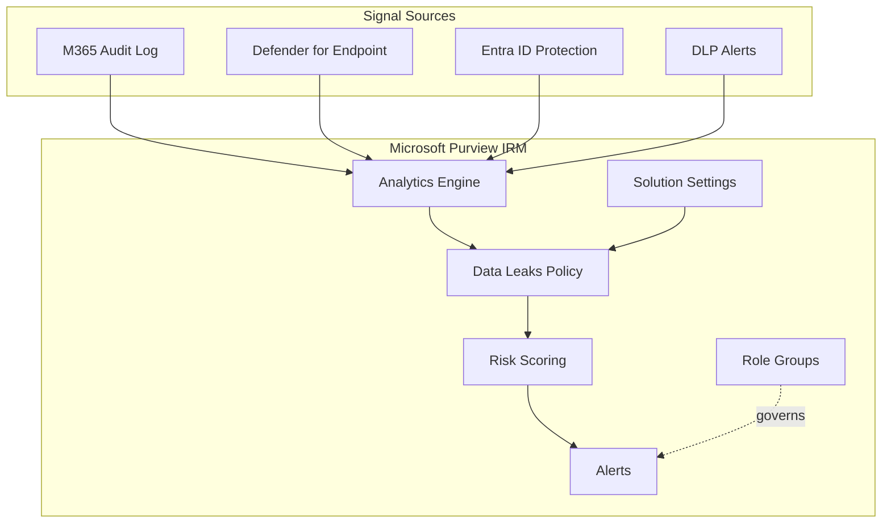
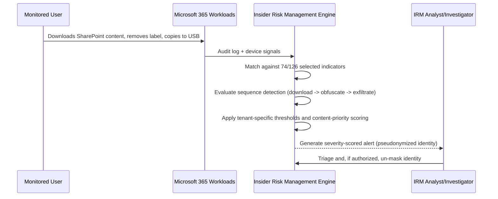

# Architecture — Microsoft Purview Insider Risk Management

## Purpose

Describe the logical architecture of the Insider Risk Management deployment implemented in this project: how signal sources, solution settings, role-based access control, and the Data Leaks policy relate to each other in Microsoft Purview.

## Component Model

| Component | Role | Evidence |
|---|---|---|
| **Signal Sources** | Microsoft 365 Unified Audit Log, Microsoft Defender for Endpoint, Microsoft Entra ID Protection, Data Loss Prevention alerts | `images/07`–`11` |
| **Analytics Engine** | Daily scans + real-time insights that establish a behavioral baseline used for tenant-specific thresholds | `images/02`, `05` |
| **Solution Settings** | Privacy (pseudonymization), Policy indicators, Intelligent detections, Domains | `images/05`–`12` |
| **Role Groups (RBAC)** | Admins, Analysts, Investigators, Approvers, Auditors, Session Approvers, base group | `images/13` |
| **Data Leaks Policy** | Tenant-wide policy: exfiltration-activity trigger, content prioritization, sequence detection | `images/14`–`28` |
| **Risk Scoring Engine** | Converts detected activity + indicator thresholds into low/medium/high severity alerts | `images/10`, `24`, `27` |

## High-Level Architecture Diagram

See [`../diagrams/Architecture.mmd`](../diagrams/Architecture.mmd).

## Detection Flow (Sequence)

## Configuration Verification

Only the following were directly observed in this lab and are treated as verified fact:

- Analytics enabled at tenant and user level.
- Privacy set to pseudonymized usernames.
- Office (30/30) and Device (15/15) indicators fully enabled tenant-wide; Defender for Endpoint and Risky browsing indicators enabled.
- Seven role groups exist; only the base group has an assigned user.
- A tenant-wide Data Leaks policy exists, reaches Healthy status, and has activity scoring started for one test user.

## Security Notes

- Insider Risk Management operates at the **behavioral/activity** layer, correlating signals across Microsoft 365, endpoint, and identity sources rather than enforcing a network or access control.
- RBAC segregation (role groups) is a structural control against any single administrator having unchecked end-to-end visibility across detection, investigation, and disciplinary approval.
- Several indicator categories are entirely dependent on optional connectors (Defender for Cloud Apps, Microsoft Fabric, physical badging, network) — architecture diagrams and coverage claims should always be qualified by which connectors are actually in place.
